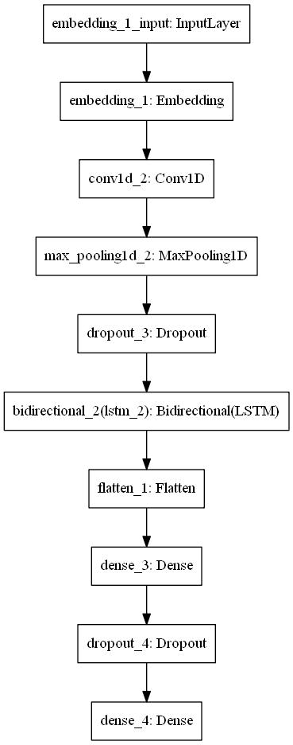
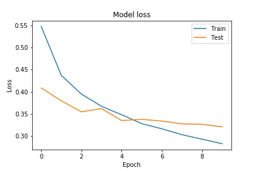
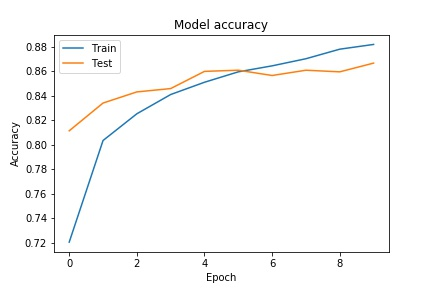

# Detecting-Sarcasm-in-Newspaper-Headlines-
This repository makes use of a bidirectional LSTM network using pre-trained word embeddings to detect sarcasm in newspaper headlines. 
  
The data used to train the model for comes from this dataset, provided by <a href="https://www.kaggle.com/rmisra/news-headlines-dataset-for-sarcasm-detection">kaggle</a>.  
The pre-trained GloVe word embeddings used, come from this <a href="http://nlp.stanford.edu/data/glove.6B.zip">download</a> by Stanford.
  
The data comes in a json format, which when processed can be read as a pandas dataframe, having one column name referring to the article link of the headline, the headline itself, and whether the headline was intended to be sarcastic or not. This data was split into training and testing, sets, and was even tested on a few made up headlines/sentences, all on which decent performace was observed.
  
The network used can be visualised as shown below: 
 
The variation of the training, and test loss throughout training is described by: 
 
The variation of accuracy, on the training, and testing set throughout training can be described by:
  
